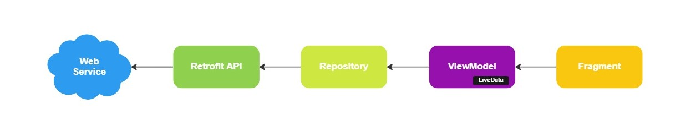
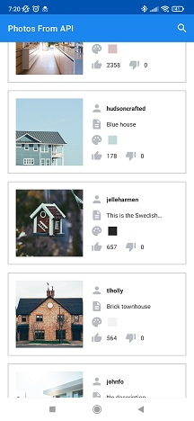
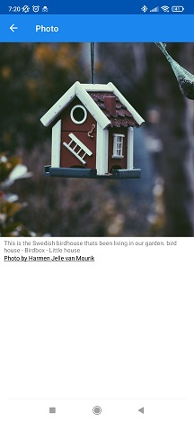
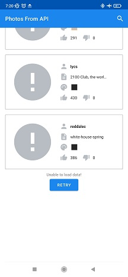
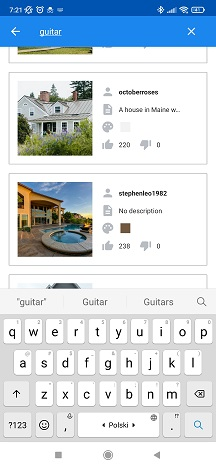
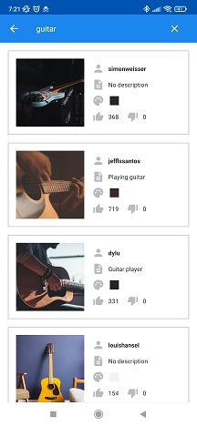

# PhotoFromApi

### Goal
Create an application to display data from unsplash.com API to user.

There are two main goals creating this application:
1. Deliver tool users can viewing photos of subject they like.
2. Practice coding, among others: MVVM, Hilt, Room, API, Retrofit, Navigation Components, Fragments, ViewModel, View Binding, LiveData, Gradle etc.

### Architecture

### Screenshots

### Overview
This application displays photo and other data as author, description, main color and number of 
likes and dislikes.
Default search query is set to "houses".

User is able to:
1. See list of photos and their data displayed in card view,
2. View single photo, it's author and description,
3. Go to the author's profile by clicking on the author's name as link, 
4. Search for other photos using searching bar, e.g guitar, mountain,

### Thank you
- [Florian Walther](https://codinginflow.com/)
- [Philipp Lackner](https://pl-coding.com/)

### Dear Visitor
If you see an opportunity to improve my code do not hesitate to contact me:
maciej.k.glownia@gmail.com. If you want to copy it and develop with your own idea, take it and enjoy
learning path.
